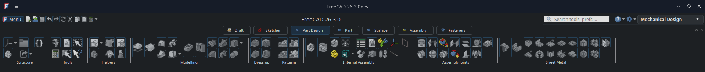

## Ribbon UI

An Ribbon UI for FreeCAD, based on the PyQtRibbon library (https://github.com/haiiliin/pyqtribbon)
and an integration with Workbench Organizer (https://github.com/Palmstroemen/WB_Organizer)

****               THIS IS A TEST DONE USING AI                    ****
**** Thanks to all the authors involved in these wonderful add-ons ****

This ribbon is based the work of Geolta (https://github.com/geolta/FreeCAD-Ribbon) and HakanSeven (https://github.com/HakanSeven12/Modern-UI) for the Modern-UI workbench.

Please refer https://github.com/APEbbers/FreeCAD-Ribbon for use
